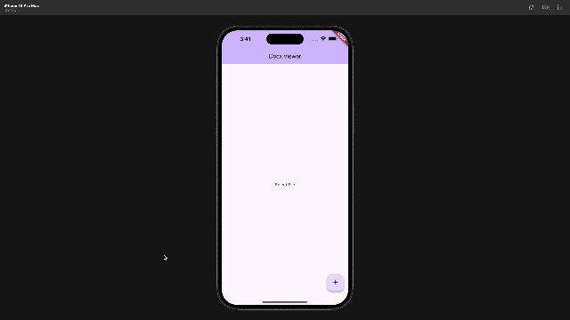

# docx_file_viewer

[](https://pub.dev/packages/docx_file_viewer)
[](https://flutter.dev)
[](https://opensource.org/licenses/MIT)

A **high-fidelity native Flutter DOCX viewer** that renders Word documents using pure Flutter widgets. No WebView, no PDF conversion—just native rendering for maximum performance and cross-platform compatibility.



## ✨ Features

| Feature | Description |
|---------|-------------|
| 🎯 **Native Flutter Rendering** | Pure Flutter widgets, no WebView or PDF conversion required |
| 📄 **View Modes** | Continuous scroll or paged (print layout) view modes |
| 📖 **Full DOCX Support** | Paragraphs, tables, lists, images, shapes, headers, footers |
| 🔍 **Text Search** | Find and highlight text with navigation controls |
| 🔎 **Pinch-to-Zoom** | Smooth zoom with configurable min/max scales |
| ✂️ **Text Selection** | Select and copy text from documents |
| 🎨 **Theming** | Light/dark themes with full customization |
| 🔤 **Embedded Fonts** | OOXML font loading with deobfuscation support |
| 📝 **Footnotes & Endnotes** | Interactive references with tap-to-view dialogs |
| 🖼️ **Floating Images** | Left/right image positioning with text wrap |

## 📦 Installation

Add `docx_file_viewer` to your `pubspec.yaml`:

```yaml
dependencies:
  docx_file_viewer: ^1.0.1
```

Then run:

```bash
flutter pub get
```

## 🚀 Quick Start

```dart
import 'package:docx_file_viewer/docx_file_viewer.dart';

// From file
DocxView.file(myFile)

// From bytes
DocxView.bytes(docxBytes)

// From path
DocxView.path('/path/to/document.docx')

// With configuration
DocxView(
  file: myFile,
  config: DocxViewConfig(
    enableSearch: true,
    enableZoom: true,
    pageMode: DocxPageMode.paged,
    theme: DocxViewTheme.light(),
  ),
)
```

## 📖 Usage Examples

### Basic Viewer

```dart
Scaffold(
  body: DocxView.file(
    File('document.docx'),
    config: DocxViewConfig(
      enableZoom: true,
      backgroundColor: Colors.white,
    ),
  ),
)
```

### Paged View (Print Layout)

```dart
DocxView(
  bytes: docxBytes,
  config: DocxViewConfig(
    pageMode: DocxPageMode.paged,  // Print-style page layout
    pageWidth: 794,                 // A4 width in pixels
    pageHeight: 1123,               // A4 height in pixels
  ),
)
```

### With Built-in Search Bar

```dart
Scaffold(
  body: DocxViewWithSearch(
    file: myDocxFile,
    config: DocxViewConfig(
      enableSearch: true,
      searchHighlightColor: Colors.yellow,
      currentSearchHighlightColor: Colors.orange,
    ),
  ),
)
```

### Dark Theme

```dart
DocxView(
  bytes: docxBytes,
  config: DocxViewConfig(
    theme: DocxViewTheme.dark(),
    backgroundColor: Color(0xFF1E1E1E),
  ),
)
```

### Programmatic Search Control

```dart
final searchController = DocxSearchController();

// Widget
DocxView(
  file: myFile,
  searchController: searchController,
)

// Control search programmatically
searchController.search('keyword');
searchController.nextMatch();
searchController.previousMatch();
searchController.clear();

// Listen to search changes
searchController.addListener(() {
  print('Found ${searchController.matchCount} matches');
  print('Current: ${searchController.currentMatchIndex + 1}');
});
```

### With Callbacks

```dart
DocxView(
  file: myFile,
  onLoaded: () {
    print('Document loaded successfully');
  },
  onError: (error) {
    print('Failed to load document: $error');
  },
)
```

## ⚙️ Configuration Options

| Property | Type | Default | Description |
|----------|------|---------|-------------|
| `enableSearch` | `bool` | `true` | Enable text search with highlighting |
| `enableZoom` | `bool` | `true` | Enable pinch-to-zoom |
| `enableSelection` | `bool` | `true` | Enable text selection |
| `minScale` | `double` | `0.5` | Minimum zoom scale |
| `maxScale` | `double` | `4.0` | Maximum zoom scale |
| `pageMode` | `DocxPageMode` | `paged` | Layout mode (continuous/paged) |
| `pageWidth` | `double?` | `null` | Fixed page width (paged mode) |
| `pageHeight` | `double?` | `null` | Fixed page height (paged mode) |
| `padding` | `EdgeInsets` | `16.0` | Document content padding |
| `backgroundColor` | `Color?` | `null` | Viewer background color |
| `showPageBreaks` | `bool` | `true` | Show visual page break separators |
| `showDebugInfo` | `bool` | `false` | Show debug placeholders for unsupported elements |
| `searchHighlightColor` | `Color` | Yellow | Background color for search matches |
| `currentSearchHighlightColor` | `Color` | Orange | Background for current match |
| `customFontFallbacks` | `List<String>` | `['Roboto', 'Arial', 'Helvetica']` | Font fallback chain |
| `theme` | `DocxViewTheme?` | Light | Document rendering theme |

## 🎨 Theming

Create a custom theme for consistent document styling:

```dart
DocxViewTheme(
  backgroundColor: Colors.white,
  defaultTextStyle: TextStyle(fontSize: 14, color: Colors.black87, height: 1.5),
  headingStyles: {
    1: TextStyle(fontSize: 28, fontWeight: FontWeight.bold),
    2: TextStyle(fontSize: 24, fontWeight: FontWeight.bold),
    3: TextStyle(fontSize: 20, fontWeight: FontWeight.w600),
    4: TextStyle(fontSize: 18, fontWeight: FontWeight.w600),
    5: TextStyle(fontSize: 16, fontWeight: FontWeight.w500),
    6: TextStyle(fontSize: 14, fontWeight: FontWeight.w500),
  },
  codeBlockBackground: Color(0xFFF5F5F5),
  codeTextStyle: TextStyle(fontFamily: 'monospace', fontSize: 13),
  blockquoteBackground: Color(0xFFF9F9F9),
  blockquoteBorderColor: Color(0xFFCCCCCC),
  tableBorderColor: Color(0xFFDDDDDD),
  tableHeaderBackground: Color(0xFFEEEEEE),
  linkStyle: TextStyle(color: Colors.blue, decoration: TextDecoration.underline),
  bulletColor: Color(0xFF333333),
)

// Or use presets
DocxViewTheme.light()
DocxViewTheme.dark()
```

## 📋 Supported DOCX Elements

| Element | Status | Notes |
|---------|--------|-------|
| **Text Formatting** | | |
| Bold, Italic, Underline | ✅ | Full support |
| Strikethrough | ✅ | Single and double |
| Superscript/Subscript | ✅ | |
| Text Colors | ✅ | Including theme colors |
| Highlight Colors | ✅ | All standard colors |
| Font Families | ✅ | With fallback chain |
| Font Sizes | ✅ | Half-point precision |
| **Paragraph Formatting** | | |
| Headings (H1-H6) | ✅ | Mapped from outline levels |
| Text Alignment | ✅ | Left, center, right, justify |
| Line Spacing | ✅ | Single, 1.5, double, exact |
| Indentation | ✅ | Left, right, first-line, hanging |
| Paragraph Borders | ✅ | All sides with colors |
| Paragraph Shading | ✅ | Background colors |
| Drop Caps | ✅ | With text wrap |
| **Lists** | | |
| Bullet Lists | ✅ | Multiple bullet styles |
| Numbered Lists | ✅ | Multiple numbering formats |
| Nested Lists | ✅ | Multi-level indentation |
| Custom Markers | ✅ | Image bullets supported |
| **Tables** | | |
| Basic Tables | ✅ | Rows, columns, cells |
| Cell Merging | ✅ | Horizontal and vertical |
| Cell Borders | ✅ | All sides with colors |
| Cell Shading | ✅ | Background colors |
| Conditional Formatting | ✅ | First/last row/col, banding |
| **Images & Shapes** | | |
| Inline Images | ✅ | Embedded and linked |
| Floating Images | ✅ | Left/right positioning |
| Basic Shapes | ✅ | Rectangles, text boxes |
| **Document Structure** | | |
| Headers | ✅ | First page, odd/even |
| Footers | ✅ | First page, odd/even |
| Footnotes | ✅ | Interactive with dialog |
| Endnotes | ✅ | Interactive with dialog |
| Page Breaks | ✅ | Visual separators |
| Section Breaks | ✅ | Page size changes |
| **Links** | | |
| Hyperlinks | ✅ | External URL support |
| Bookmarks | 🔄 | Partial support |
| **Other** | | |
| Embedded Fonts | ✅ | OOXML deobfuscation |
| Style Inheritance | ✅ | Full cascade support |
| Checkboxes | ✅ | Checked/unchecked states |

## 🔗 Integration with docx_creator

This package uses [docx_creator](https://pub.dev/packages/docx_creator) for parsing DOCX files:

```dart
import 'package:docx_creator/docx_creator.dart';
import 'package:docx_file_viewer/docx_file_viewer.dart';

// Create a document
final doc = docx()
  .h1('My Document')
  .p('This is a paragraph with some text.')
  .table([
    ['Header 1', 'Header 2'],
    ['Cell 1', 'Cell 2'],
  ])
  .build();

// Export to bytes
final bytes = await DocxExporter().exportToBytes(doc);

// View immediately
DocxView.bytes(Uint8List.fromList(bytes))
```

## 🔍 Search API

The `DocxSearchController` provides full control over document search:

```dart
final controller = DocxSearchController();

// Properties
controller.query;              // Current search query
controller.matches;            // All found matches
controller.matchCount;         // Number of matches
controller.currentMatchIndex;  // Current match index (0-based)
controller.currentMatch;       // Current SearchMatch object
controller.isSearching;        // Whether search is active

// Methods
controller.search('text');     // Search for text
controller.nextMatch();        // Go to next match
controller.previousMatch();    // Go to previous match
controller.clear();            // Clear search
controller.getBlockText(idx);  // Get text at block index

// Listen to changes
controller.addListener(() => print('Search updated'));
```

## 📱 Platform Support

| Platform | Support |
|----------|---------|
| iOS | ✅ |
| Android | ✅ |
| Web | ✅ |
| macOS | ✅ |
| Windows | ✅ |
| Linux | ✅ |

## 🤝 Contributing

Contributions are welcome! Please read our contributing guidelines and submit pull requests to our repository.

## 📄 License

MIT License - see [LICENSE](LICENSE) for details.

## 🔗 Links

- [Pub.dev Package](https://pub.dev/packages/docx_file_viewer)
- [GitHub Repository](https://github.com/alihassan143/htmltopdfwidgets)
- [Issue Tracker](https://github.com/alihassan143/htmltopdfwidgets/issues)
- [docx_creator Package](https://pub.dev/packages/docx_creator)
